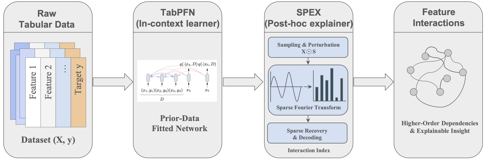

<h1 align="center"> ⚗️ TabDistill ⚗️ </h1>
<p align="center"> <b>Selecting Feature Interactions for GAMs by Distilling Foundation Models</b> (<a href="https://arxiv.org/abs/2604.13332">Jia, Singh, Carauana, & Lengerich 2026</a>).
</p>

<p align="center">
  
  
</p>  



The repo is organized around three themes:

1. **TabArena workflow** — how to run interaction selection (TabDistill) and evaluate downstream models on the benchmark tasks.
2. **Experiments and simulations** — batch pipelines under `experiments/` (including broader benchmarks such as PMLB Table 1).
3. **Case study** — narrative analysis in the notebooks (e.g. `notebooks/03_case_study.ipynb`).

### Installation

Setup using uv (requires [installing uv](https://docs.astral.sh/uv/getting-started/installation/) then run a script using `uv run <script>`).

- Set appropriate paths in `src/config.py` for caching OpenML datasets and TabPFN models.
- Note: relies heavily on and makes small modifications to the [spex](https://github.com/basics-lab/spectral-explain) library

### Organization

- **`src/`** — importable utilities, `config.py`, Talent OpenML helpers, vendored `spectralexplain`.
- **`experiments/`** — runnable pipelines: `interaction_search/` (TabArena interaction pickles), `TabDistill_downstream_comparison/` (index and baseline comparisons), `EBM_comparison/` (PMLB Table 1).
- **`notebooks/`** — EDA and case study notebooks (and related scripts).

### Dataset

Source: TabArena benchmark
Selection Rule: N < 10000, p < 10
Total: 10 datasets
Task types: Regression & Classification

| Task ID | Dataset Name                          | Task Type                 | Problem Description                            |
| ------: | ------------------------------------- | ------------------------- | ---------------------------------------------- |
|  363621 | blood-transfusion-service-center      | Binary Classification     | Predict whether a blood donor will return      |
|  363629 | diabetes                              | Binary Classification     | Predict diabetes onset                         |
|  363698 | QSAR_fish_toxicity                    | Regression                | Predict chemical toxicity to fish              |
|  363685 | maternal_health_risk                  | Multiclass Classification | Predict maternal health risk level             |
|  363625 | concrete_compressive_strength         | Regression                | Predict concrete compressive strength          |
|  363671 | Fitness_Club                          | Binary Classification     | Predict customer churn / subscription behavior |
|  363612 | airfoil_self_noise                    | Regression                | Predict airfoil noise level                    |
|  363615 | Another-Dataset-on-used-Fiat-500      | Regression                | Predict used car prices                        |
|  363674 | hazelnut-spread-contaminant-detection | Binary Classification     | Detect food contamination                      |
|  363700 | seismic-bumps                         | Binary Classification     | Predict seismic event bumps                    |

### Usage

Run commands from the **repository root** unless noted.

**1. TabArena — batch interaction search**

Script: `experiments/interaction_search/tabarena_batch_tasks_mulindex.py` (imports `tabarena_single_mulindex.process_task`). It writes, for each task id and index type, files such as `interactions_summary_{task_id}_{index_type}.pkl` under the chosen output directory.

Default output directory in code is `experiments/interaction_search/interaction_1_14_2026_500` (override with `--output-dir`).

```bash
# All default TabArena task IDs; --num-samples 0 means use all training rows (can be slow)
uv run python experiments/interaction_search/tabarena_batch_tasks_mulindex.py --num-samples 0

# Subset of tasks and custom output folder
uv run python experiments/interaction_search/tabarena_batch_tasks_mulindex.py 363671 363698 --num-samples 2 --output-dir my_results
```

**2. TabArena — compare SPEX indices on downstream EBM**

Script: `experiments/TabDistill_downstream_comparison/compare_index_performance.py`. Expects summaries named `interactions_summary_{task_id}_{index_type}.pkl` under `--interaction-dir`.

Default `--interaction-dir` is `experiments/interaction_search/interaction_output` (not the batch script’s default folder). If you used the batch default output, point `--interaction-dir` at that path (e.g. `experiments/interaction_search/interaction_1_14_2026_500`).

```bash
uv run python experiments/TabDistill_downstream_comparison/compare_index_performance.py 363698 10 --max-interaction-order 4 --output comparison.png --no-show --interaction-dir experiments/interaction_search/interaction_1_14_2026_500
```

**3. Batch driver (index comparison + RuleFit baseline)**

`experiments/TabDistill_downstream_comparison/run.py` loops over tasks and subprocesses `compare_index_performance.py` and `rulefit_baseline_ebm.py`. Use `--interaction-dir` consistent with step 1.

```bash
uv run python experiments/TabDistill_downstream_comparison/run.py --experiment all
uv run python experiments/TabDistill_downstream_comparison/run.py --tasks 363615 363698 --experiment index --interaction-dir experiments/interaction_search/interaction_1_14_2026_500
```

**4. PMLB Table 1 pipeline**

`experiments/EBM_comparison/run.py` — see the module docstring for step list and `python experiments/EBM_comparison/run.py --help`.

### Parameters

**`tabarena_batch_tasks_mulindex.py`**

- **`task_ids`** (optional positionals): OpenML task ids; if omitted, uses the built-in TabArena list.
- **`--num-samples`**: Training rows to process per task; **`0` = all rows** (default in argparse is `0`).
- **`--output-dir`**: Directory for pickles (default: `experiments/interaction_search/interaction_1_14_2026_500`).

**`compare_index_performance.py`**

- **`task_id`** (positional): OpenML task id.
- **`N_interactions`** (positional): Number of interactions to feed into the SPEX-EBM pipeline (not a `--flag`).
- **`--output` / `-o`**: Controls where the figure is saved: the script resolves a **directory** from this argument (e.g. `out/plot.png` → `out/`; `plot.png` → `.`). The image filename is always **`index_comparison_{task_id}_{order}.png`** in that directory—not necessarily the name you pass. If `-o` is omitted, **no PNG** is written; **`index_results_{task_id}_{order}.csv`** is still saved under **`.`** (cwd).
- **`--max-interaction-order`**: `2`, `3`, or `4` (default **`2`**): 2-way only; 2+3-way; or 2+3+4-way.
- **`--interaction-dir`**: Folder with `interactions_summary_{task_id}_*.pkl` (default **`experiments/interaction_search/interaction_output`** relative to repo layout).
- **`--no-show`**: Do not open an interactive plot window (typical for headless / when saving).
- **`--indices`**: Space-separated index names to compare (e.g. `fbii bii sii`); default is all indices found under `--interaction-dir` for that task. Typical index names match the batch run: `fbii`, `fsii`, `stii`, `bii`, `sii`, `fourier`, `mobius`.

**`rulefit_baseline_ebm.py`** (same positional `task_id` and `N_interactions`; no `--interaction-dir` / `--indices`). **`--max-interaction-order`** applies to the RuleFit side; **`--output`**, **`--no-show`** as above.

**`experiments/TabDistill_downstream_comparison/run.py`**

- **`--tasks`**: OpenML ids (default: all ten TabArena ids in code).
- **`--experiment`**: `all` | `index` | `baseline`.
- **`--interaction-dir`**: Pickle root for the index experiment (default: `experiments/interaction_search/interaction_output`).
- **`--output-dir`**: Base directory for subprocess outputs (default: `experiments/TabDistill_downstream_comparison/output`).

```r
@misc{jia2026tabdistill,
      title={Selecting Feature Interactions for Generalized Additive Models by Distilling Foundation Models}, 
      author={Jingyun Jia and Chandan Singh and Rich Caruana and Ben Lengerich},
      year={2026},
      eprint={2604.13332},
      archivePrefix={arXiv},
      primaryClass={cs.LG},
      url={https://arxiv.org/abs/2604.13332}, 
}
```
